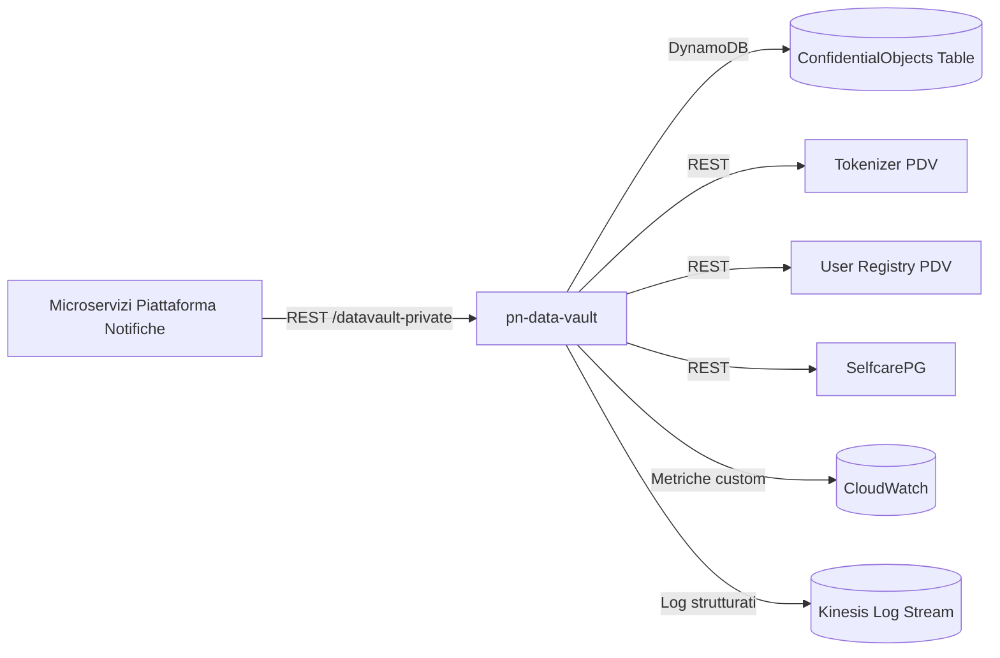

# pn-data-vault

## Indice

- [Descrizione](#descrizione)
- [Tecnologie Utilizzate](#tecnologie-utilizzate)
- [Architettura](#architettura)
- [Interfacce del Servizio](#interfacce-del-servizio)
- [Configurazioni](#configurazioni)
- [Allarmi e Monitoraggio](#allarmi-e-monitoraggio)
- [Esecuzione](#esecuzione)

## Descrizione

Il servizio gestisce le informazioni confidenziali di Piattaforma Notifiche (SEND), fungendo da vault centralizzato per i dati sensibili dei destinatari e delle comunicazioni. Espone API REST private, invocate dagli altri microservizi della piattaforma, per la generazione di identificativi opachi, la lettura e la scrittura di domicili e recapiti, delle deleghe, delle notifiche, dei messaggi di comunicazione bonaria e degli indirizzi di spedizione analogica. Per la tokenizzazione e la deanonimizzazione dei dati anagrafici invoca i servizi esterni Tokenizer PDV, User Registry PDV e SelfcarePG. I dati sono persistiti in forma cifrata su Amazon DynamoDB.

## Tecnologie Utilizzate

### Stack Tecnologico

- Java, Spring Boot 3 (parent `pn-parent`, profilo Spring Boot 3)
- Spring WebFlux (stack reattivo)
- OpenAPI Generator (Maven plugin) per la generazione degli stub server e dei client REST verso Tokenizer PDV, User Registry PDV e SelfcarePG
- AWS SDK v2 - DynamoDB Enhanced Client
- Caffeine (cache in memoria)
- Resilience4j (rate limiting reattivo verso i servizi esterni)
- Spring Boot Actuator
- Logstash Logback Encoder (log applicativi in formato strutturato)
- Lombok

### Infrastruttura

- Amazon ECS dietro Application Load Balancer
- Amazon DynamoDB (tabella `ConfidentialObjects`, cifrata con AWS KMS, Point-in-Time Recovery attivo, TTL sull'attributo `expiration`)
- Amazon Kinesis (stream per i log applicativi e per il change data capture della tabella DynamoDB)
- Amazon CloudWatch (log group e metriche custom)
- AWS KMS (cifratura dei dati confidenziali)

## Architettura



I microservizi di Piattaforma Notifiche invocano le API REST private esposte da pn-data-vault per leggere o scrivere dati confidenziali. Il servizio persiste tali dati, cifrati, sulla tabella DynamoDB `ConfidentialObjects` e delega a Tokenizer PDV, User Registry PDV e SelfcarePG la tokenizzazione e la deanonimizzazione dei dati anagrafici dei destinatari persone fisiche e giuridiche. Log applicativi e metriche custom sono inviati rispettivamente a Kinesis e CloudWatch.

## Interfacce del Servizio

| Tipo | Dir | Risorsa | Protocollo | Metodo | Route | Descrizione |
|------|-----|---------|------------|--------|-------|-------------|
| API | IN | Recipients | REST | POST | `/datavault-private/v1/recipients/external/{recipientType}` | Genera un id opaco per un destinatario a partire dal codice fiscale/PIVA |
| API | IN | Recipients | REST | GET | `/datavault-private/v1/recipients/internal` | Deanonimizza un elenco di destinatari a partire dagli id opachi |
| API | IN | AddressBook | REST | GET | `/datavault-private/v1/recipients/internal/{internalId}/addresses` | Elenca domicili e recapiti di un destinatario |
| API | IN | AddressBook | REST | PUT | `/datavault-private/v1/recipients/internal/{internalId}/addresses/{addressId}` | Inserisce o modifica un domicilio o recapito |
| API | IN | AddressBook | REST | DELETE | `/datavault-private/v1/recipients/internal/{internalId}/addresses/{addressId}` | Cancella un domicilio o recapito |
| API | IN | Messages | REST | POST | `/datavault-private/v1/messages` | Crea un nuovo template di messaggio di comunicazione bonaria |
| API | IN | Messages | REST | GET | `/datavault-private/v1/messages/{messageId}` | Recupera il contenuto confidenziale di un messaggio |
| API | IN | Mandates | REST | GET | `/datavault-private/v1/mandates` | Legge i dati di contatto di un elenco di deleghe |
| API | IN | Mandates | REST | PUT | `/datavault-private/v1/mandates/{mandateId}` | Inserisce o modifica il recapito di una delega |
| API | IN | Mandates | REST | DELETE | `/datavault-private/v1/mandates/{mandateId}` | Elimina il recapito di una delega |
| API | IN | Notifications | REST | DELETE | `/datavault-private/v1/notifications/{iun}` | Elimina le informazioni confidenziali di una notifica |
| API | IN | Notifications | REST | GET | `/datavault-private/v1/notifications/{iun}/addresses` | Legge i domicili dei destinatari di una notifica |
| API | IN | Notifications | REST | PUT | `/datavault-private/v1/notifications/{iun}/addresses` | Inserisce o aggiorna i domicili dei destinatari di una notifica |
| API | IN | Notifications | REST | GET | `/datavault-private/v1/notifications/{iun}/timeline` | Legge l'intera timeline confidenziale di una notifica |
| API | IN | Notifications | REST | POST | `/datavault-private/v1/timelines` | Legge le informazioni confidenziali per una lista di elementi di timeline |
| API | IN | Notifications | REST | GET | `/datavault-private/v1/notifications/{iun}/timeline/{timelineElementId}` | Legge un elemento di timeline |
| API | IN | Notifications | REST | PUT | `/datavault-private/v1/notifications/{iun}/timeline/{timelineElementId}` | Inserisce o aggiorna un elemento di timeline |
| API | IN | PaperAddresses | REST | GET | `/datavault-private/v1/paper-addresses/{paperRequestId}` | Recupera tutti gli indirizzi analogici associati a una spedizione |
| API | IN | PaperAddresses | REST | GET | `/datavault-private/v1/paper-addresses/{paperRequestId}/{paperAddressId}` | Recupera un indirizzo analogico associato a una spedizione |
| API | IN | PaperAddresses | REST | PUT | `/datavault-private/v1/paper-addresses/{paperRequestId}/{paperAddressId}` | Inserisce o modifica un indirizzo analogico |
| API | IN | PaperAddresses | REST | DELETE | `/datavault-private/v1/paper-addresses/{paperRequestId}/{paperAddressId}` | Elimina un indirizzo analogico |
| API | OUT | Tokenizer PDV | REST | PUT | `/tokens` | Genera un id opaco (token) per un destinatario persona fisica |
| API | OUT | Tokenizer PDV | REST | GET | `/tokens/{token}/pii` | Recupera il dato in chiaro a partire dal token |
| API | OUT | User Registry PDV | REST | GET | `/users/{id}` | Recupera nome, cognome e codice fiscale di un destinatario a partire dall'id opaco |
| API | OUT | SelfcarePG | REST | POST | `/pn-pg/institutions/add` | Genera un id opaco per un destinatario persona giuridica |
| API | OUT | SelfcarePG | REST | GET | `/institutions/{id}` | Recupera denominazione e codice fiscale di una persona giuridica a partire dall'id opaco |

Specifica OpenAPI delle API esposte: [`docs/openapi/pn-datavault-api-v1.yaml`](docs/openapi/pn-datavault-api-v1.yaml).
Specifiche OpenAPI dei client verso i servizi esterni: [`docs/wsclient/`](docs/wsclient/).

## Configurazioni

| Nome | Sorgente | Valori | Descrizione |
|------|----------|--------|-------------|
| `PN_ENV_RUNTIME` | ENV | `PROD`, `DEVELOPMENT` | Abilita la modalità di sviluppo (log di warning all'avvio) quando valorizzato a `DEVELOPMENT`; default `PROD` |
| `PN_DATA_VAULT_CLOUDWATCH_METRIC_CRON` | ENV | espressione cron (default `*/10 * * * * *`) | Frequenza di pubblicazione su CloudWatch della metrica custom sullo stato dei rate limiter verso Tokenizer PDV e SelfcarePG |
| `ConfidentialObjectsDynamoTableName` | CloudFormation | nome tabella DynamoDB | Nome della tabella DynamoDB `ConfidentialObjects` in cui sono persistiti i dati confidenziali cifrati |
| `PDVTokenizerBasePath` | CloudFormation | URL | Base path del servizio Tokenizer PDV invocato per la tokenizzazione/deanonimizzazione dei destinatari persona fisica |
| `PDVUserRegistryBasePath` | CloudFormation | URL | Base path del servizio User Registry PDV invocato per la deanonimizzazione dei destinatari persona fisica |
| `SelfcarePgBasePath` | CloudFormation | URL | Base path del servizio SelfcarePG invocato per la tokenizzazione/deanonimizzazione dei destinatari persona giuridica |
| `CacheExpireMinutes` | CloudFormation | numero minuti (default `5`) | Durata di validità della cache in memoria (Caffeine) usata per le risposte di tokenizzazione/deanonimizzazione |
| `CacheMaxSize` | CloudFormation | numero elementi (default `100000`) | Numero massimo di elementi mantenuti nella cache in memoria (Caffeine) |
| `MessageExpiration` | CloudFormation | secondi | TTL applicato ai messaggi di comunicazione bonaria persistiti su DynamoDB |

## Allarmi e Monitoraggio

| Tipo | Nome | Descrizione |
|------|------|-------------|
| LOG | Log applicativi su Kinesis | I log dell'applicazione, in formato strutturato (logstash-logback-encoder), sono raccolti nel log group `<ProjectName>-data-vault-sep` e instradati allo stream Kinesis indicato da `ConfidentialInfoLogsKinesisSourceStreamArn`, con retention configurabile (`LogRetention`, default 14 giorni); utilizzati per troubleshooting e audit delle operazioni sui dati confidenziali |

## Esecuzione

Prerequisiti: JDK compatibile con Spring Boot 3, Maven Wrapper incluso nel progetto, Docker (per la creazione dell'immagine e l'esecuzione dei test e2e).

```bash
# Compilazione e test
./mvnw clean install
```

```bash
# Creazione immagine docker
./mvnw clean spring-boot:build-image
```

```bash
# Esecuzione immagine docker
docker run -p 9804:8080 pn-data-vault:2.17.0-SNAPSHOT
```

```bash
# Esecuzione test e2e
docker run -v $(pwd)/scripts/taurus:/configs blazemeter/taurus -o settings.env.BASE_URL=http://host.docker.internal:9804/  /configs/main.yaml
```
